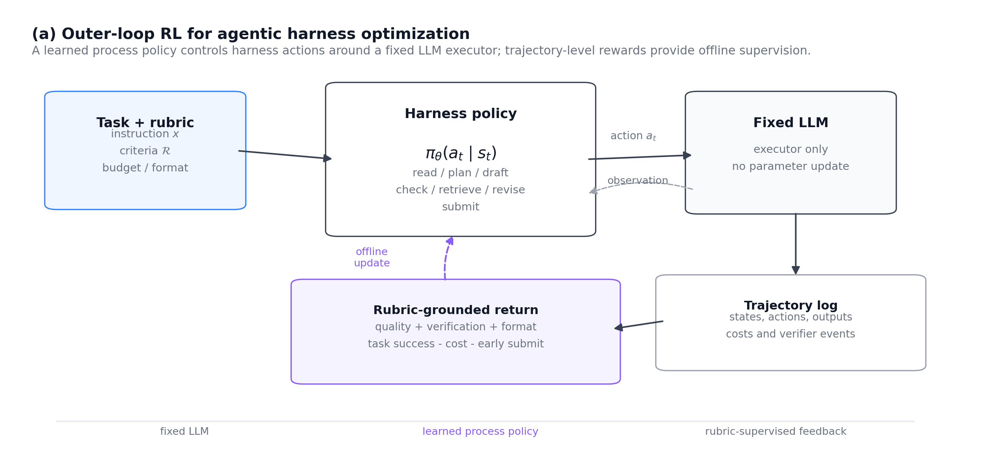
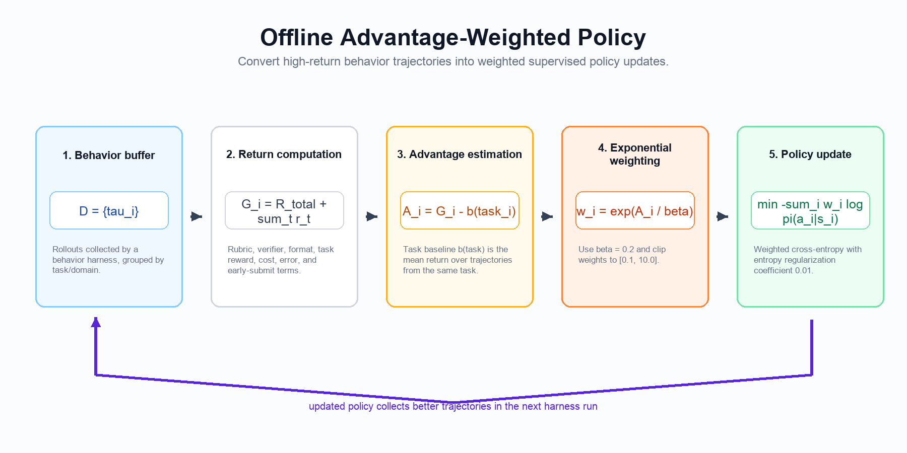

# Learning to Control LLM Agent Harnesses with Offline Reinforcement Learning

<p align="center">
  <a href="https://arxiv.org/abs/2607.05458"></a>
  <a href="LICENSE"></a>
  <a href="requirements.txt"></a>
</p>


Code release for **Learning to Control LLM Agent Harnesses with Offline Reinforcement Learning**.

The project treats an agentic harness as an outer-loop control policy over a fixed LLM executor. A lightweight offline RL controller learns when to read, draft, verify, revise, retrieve evidence, and submit by optimizing rubric-grounded trajectory returns rather than changing the underlying LLM.

<p align="center">
  
</p>

## At a Glance

- **Research question.** Can offline reinforcement learning choose better harness interventions for LLM agents without changing the base model?
- **Core idea.** The harness is treated as a controllable policy over observation, verification, repair, and reward signals.
- **What is included.** Synthetic domains, held-out benchmark settings, reward aggregation, detector checks, and main-table reproduction scripts.

## Method

The main training routine is an offline advantage-weighted policy update over trajectories collected from a behavior harness.

<p align="center">
  
</p>

## Key Contributions

- Outer-loop policy learning for agentic harnesses while keeping the base LLM fixed.
- Rubric, verifier, format, task, cost, and early-submit terms in a single reward aggregator.
- Harness Maturity Score detector for process behaviors such as verification, revision, and evidence use.
- Offline Advantage-Weighted policy training implemented in PyTorch.
- Reproduction scripts for synthetic domains and held-out public benchmark settings.

## Quick Start

```bash
git clone git@github.com:Hik289/Agentic-RL-harness.git
cd Agentic-RL-harness
python -m venv .venv
source .venv/bin/activate
pip install -r requirements.txt
export PYTHONPATH="$PWD/code"
```

Configure the provider:

```bash
cp .env.example .env
$EDITOR .env
source .env
```

Run the API smoke check:

```bash
python examples/anchor_1_api_check.py
```

For offline, no-LLM checks, start with:

```bash
python examples/anchor_4_reward_aggregator.py
python examples/anchor_6_hms_detector.py
```

## Repository Structure

```text
.
├── code/
│   ├── harness/              # base harness execution machinery
│   ├── modules/              # Harness Maturity Score detector
│   ├── reward/               # rubric, format, verifier, cost, and aggregate reward
│   └── rl/                   # offline AW training and domain harnesses
├── examples/                 # anchor checks, main driver, and analyses
├── figures/                  # README diagrams
├── .env.example              # API provider and path configuration
├── requirements.txt
└── README.md
```

## Configuration

The LLM client reads a general OpenAI-compatible API configuration from the environment:

```bash
export OPENAI_BASE_URL="https://api.openai.com/v1"
export OPENAI_API_KEY="<your-api-key>"
export OPENAI_MODEL="gpt-5.4-mini"
export AGENTICRLHARNESS_DATA="./data"
export AGENTICRLHARNESS_RESULTS="./results"
```

Generated data, results, caches, and local `.env` files are ignored by git.

## Reproducing the Main Table

Each domain follows `collect -> train -> evaluate`. The driver writes results to `AGENTICRLHARNESS_RESULTS/main_{domain}/results.json`.

```bash
for D in knowledge_work coding research multi_tool long_memory planning; do
  python examples/running_main_driver.py --domain "$D"
done
```

Held-out public benchmark settings:

```bash
python examples/running_main_driver.py \
  --domain tau_bench_retail_v2_heldout \
  --eval_task_ids tau_retail_003,tau_retail_005,tau_retail_011,tau_retail_015 \
  --n_rollouts_collect 20 --n_rollouts_eval 3 --n_eval_seeds 3

python examples/running_main_driver.py \
  --domain agentbench_dbbench \
  --eval_task_ids agentbench_dbbench_003,agentbench_dbbench_007,agentbench_dbbench_012,agentbench_dbbench_017 \
  --n_rollouts_collect 20 --n_rollouts_eval 3 --n_eval_seeds 3

python examples/main_table_analysis.py
```

## Hyperparameters

The single source of truth is `code/rl/offline_aw.py::AWConfig`.

| Component | Value |
|---|---:|
| Policy network | 1-hidden-layer MLP, 64 hidden units |
| State dimension | 18 |
| Optimizer | Adam |
| Learning rate | 1e-3 |
| Epochs / batch size | 20 / 256 |
| AW temperature beta | 0.2 |
| Weight clip | [0.1, 10.0] |
| Entropy coefficient | 0.01 |
| Seeds per domain | 3 |

## Artifact Checklist

- **Code release.** Core implementations, configuration files, and reproduction entry points are versioned in this repository.
- **Reproducibility.** Start with the smoke or quick-start path before paper-scale runs; record the commit hash, Python version, backend/model identifiers, seeds, and command-line arguments.
- **Data and credentials.** Large datasets, benchmark downloads, generated outputs, and API keys are intentionally excluded. Use the data and configuration notes above to recreate them or point to local copies.
- **Reporting.** For paper-scale runs, keep raw run folders immutable and regenerate tables or figures from the logged artifacts with the listed analysis scripts.

## Citation

```bibtex
@misc{yi2026learningcontrolllmagentharnesses,
  title         = {Learning to Control LLM Agent Harnesses with Offline Reinforcement Learning},
  author        = {Haiwen Yi and Xinyuan Song},
  year          = {2026},
  eprint        = {2607.05458},
  archivePrefix = {arXiv},
  primaryClass  = {cs.LG},
  url           = {https://arxiv.org/abs/2607.05458}
}
```

## License

MIT. See [LICENSE](LICENSE).
